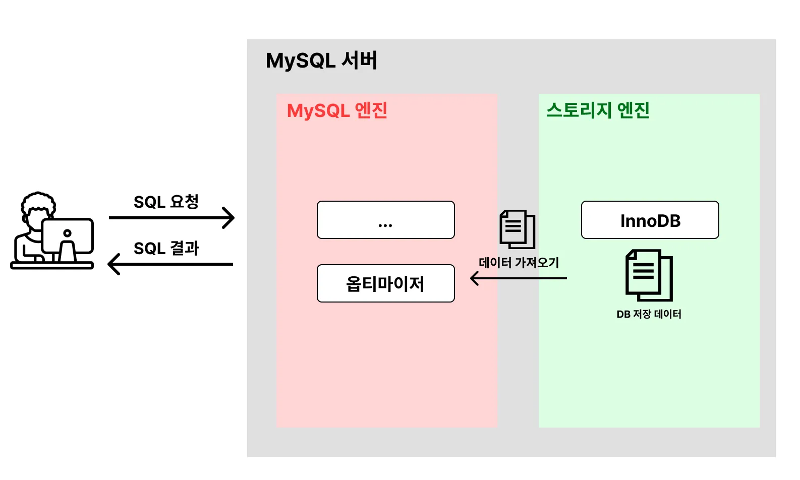
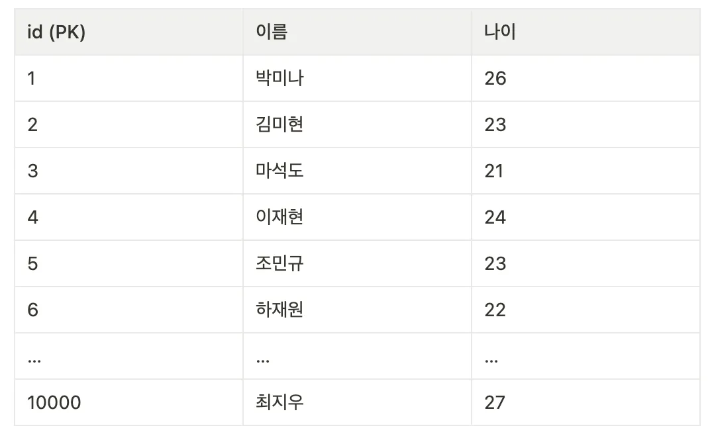
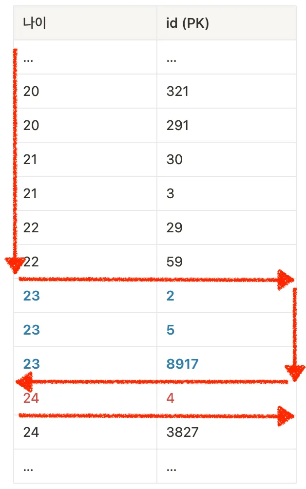
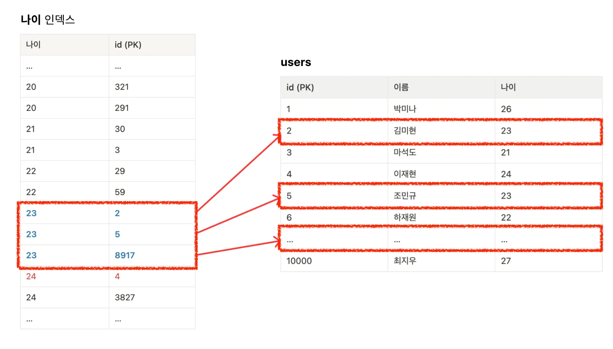
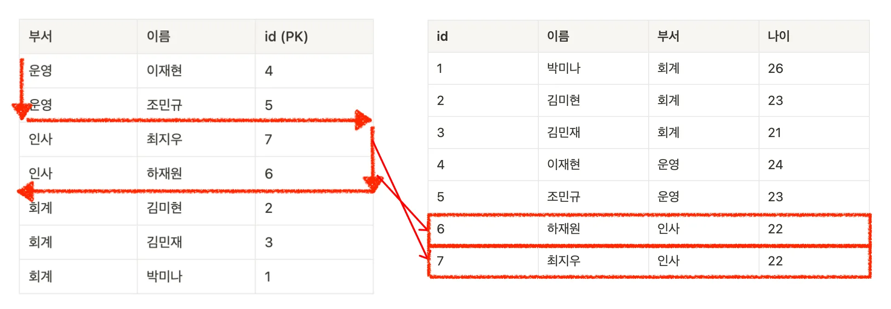
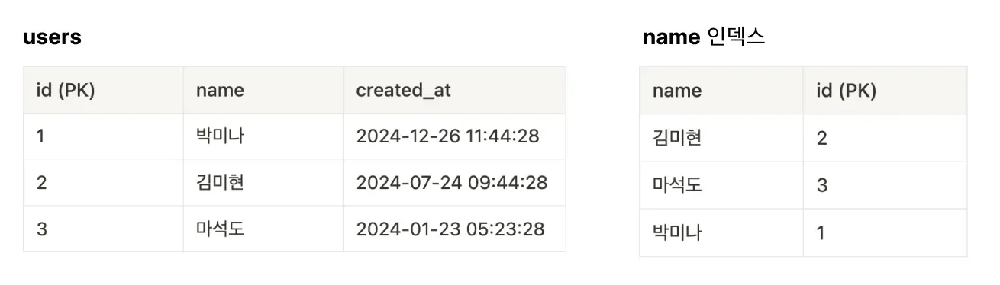
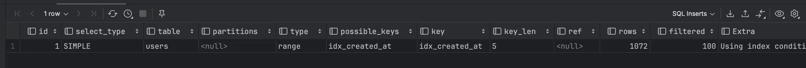
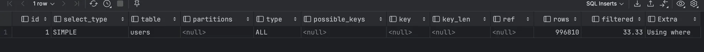
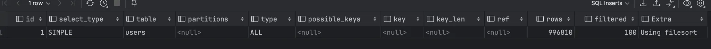

# MySQL 성능 최적화 기초 및 실습

## 0. DB는 왜 느려질까?

1. 동시 사용자 수 증가
2. 데이터 양의 증가
3. **비효율적인 SQL 문 작성**

## 1. DB 성능 개선할 때 SQL 튜닝을 가장 먼저 해야하는 이유

### DB 성능을 개선하는 방법

1. SQL 튜닝
2. 캐싱 서버 활용 (Redis 등)
3. 레플리케이션 (Master, Slave 구조)
4. 샤딩
5. 스케일업 (CPU, Memory, SSD 등 하드웨어 업그레이드)

### 많은 성능 개선 방법 중 왜 SQL 튜닝을 먼저 고려해야할까?

1. SQL 튜닝을 제외한 나머지 방법은 추가적인 시스템을 구축해야한다. 따라서 금전적, 시간적 비용이 추가적으로 발생한다. 조금 더 복잡해진 시스템 구조로 인해 관리 비용이 늘어난다. 그에 비해 SQL 튜닝은 기존의 시스템 변경 없이 성능을 개선할 수 있다.
2. **근본적인 문제 해결방법**이 SQL 튜닝일 가능성이 높다. **SQL 자체가 비효율적으로 작성됐다면 아무리 시스템적으로 성능을 개선한다고 해도 한계가 있다.** 하지만 SQL 튜닝을 통해 기본적으로 성능을 향상시킨다면, 시스템적인 성능 개선이 필요 없거나, 훨씬 간단한 개선으로 큰 성능 개선 효과를 얻을 수 있다.

**요약하자면, DB 성능 개선 방법 중 가장 가성비가 좋은 방법이 SQL 튜닝이다.**

## 2. 성능 개선을 위한 MySQL 구조 파악 / SQL 튜닝의 핵심

MySQL 구조를 파악해야하는 이유?

- 어떤 부분에서 MySQL의 성능을 많이 잡아 먹는지, 어떤 요인이 주로 문제를 일으키는 지 파악할 수 있어야한다. 그 원인을 파악하기 위해서는 MySQL 구조를 알아야한다.

### MySQL의 아키텍처



MySQL의 아키텍처를 간단하게 표현하자면 위와 같다.

1. 클라이언트가 DB에 SQL 요청을 보낸다.
2. MySQL 엔진에서 **옵티마이저**가 SQL문을 분석한 뒤 빠르고 효율적으로 데이터를 가져올 수 있는 계획을 세운다. 어떤 순서로 테이블에 접근할 지, 인덱스를 사용할 지, 어떤 인덱스를 사용할 지 등을 결정한다.
   **(옵티마이저가 세운 계획은 완벽하지 않다. 따라서 SQL 튜닝이 필요하다.)**
3. 옵티마이저가 세운 계획을 바탕으로 스토리지 엔진에서 데이터를 가져온다.
   **(DB 성능에 문제가 생기는 대부분의 원인은 스토리지 엔진으로부터 데이터를 가져올 때 발생한다. 데이터를 찾기가 어려워서 오래 걸리거나, 가져올 데이터가 너무 많아서 오래 걸린다. SQL 튜닝의 핵심은 스토리지 엔진으로부터 되도록이면 데이터를 찾기 쉽게 바꾸고, 적은 데이터를 가져오도록 바꾸는 것을 말한다.)**
4. MySQL 엔진에서 정렬, 필터링 등의 마지막 처리를 한 뒤에 클라이언트에게 SQL 결과를 응답한다.

### SQL 튜닝의 핵심

SQL 튜닝에 있어서 핵심은 2가지이다.

1. **스토리지 엔진에서 데이터를 찾기 쉽게 바꾸기**
2. **스토리지 엔진으로부터 가져오는 데이터의 양 줄이기**

그럼 이 2가지를 어떻게 해결할 수 있을까?

여러가지 방법이 많지만 가장 많이 활용되는 방법이 **인덱스 활용**이다. 인덱스가 어떤 개념이길래 위 2가지 문제를 해결할 수 있는 지 알아보자.

> 단순히 **인덱스**만 적용한다고 해서 무조건 해결되는 게 아니다. 인덱스를 **‘적절하게’** 활용해야만 DB 성능이 개선된다. 이 방법에 대해 깊이 있게 다루기 전에 ‘**인덱스**’라는 개념에 대해 제대로 한 번 정리하고 넘어가자.
>

## 3. 인덱스(Index)란?

인덱스의 정의를 찾아보면 아래와 같다.

> 인덱스(Index)는 데이터베이스 테이블에 대한 검색 성능의 속도를 높여주는 자료 구조를 뜻한다.
>

### 예시를 통해 인덱스 의미를 직관적으로 이해해보자.

아래와 같은 `users` 테이블이 있다고 가정하자.



위 1만개의 데이터 중에서 나이가 23살인 사용자를 찾으려고 해보자. 찾기 위해서는 모든 행을 다 검사해야한다. → 시간이 오래걸림



**“하지만 위와 같이 나이 순으로 정렬된 표가 있다면 어떨까?”**




나이순으로 정렬된 표가 있다면 23살로 시작하는 지점과 24살로 시작하는 지점만 찾은 뒤 그 사이 모든 값을 가져오면 된다. → 미리 정렬을 해놓으면 모든 데이터를 전부 확인할 필요 없이 효율적으로 데이터 조회가 가능하다.

위의 예시에서 **나이 순으로 정렬된 표**가 **인덱스**이다. 정확히 말하자면 **나이 컬럼을 기준으로 인덱스를 생성한 것**이다. 이러한 특징 때문에 데이터를 찾는 속도를 빠르게 만들기 위해서 인덱스를 많이 활용한다.

참고로 실제 DB에서는 인덱스를 생성한다고 해서 정렬된 표를 직접 눈으로 확인할 수는 없다. 시스템 내부적으로 생성될 뿐이다.

### 인덱스 실습

1. 테이블 생성

```sql
DROP TABLE IF EXISTS practice.users; # 기존 테이블 삭제

CREATE TABLE practice.users (
    id INT AUTO_INCREMENT PRIMARY KEY,
    name VARCHAR(100),
    age INT
);
```

1. 100만건 랜덤 데이터 삽입

```sql
-- 높은 재귀(반복) 횟수를 허용하도록 설정
-- (아래에서 생성할 더미 데이터의 개수와 맞춰서 작성하면 된다.)
SET SESSION cte_max_recursion_depth = 1000000;

-- 더미 데이터 삽입 쿼리
INSERT INTO practice.users (name, age)
WITH RECURSIVE cte (n) AS
(
  SELECT 1
  UNION ALL
  SELECT n + 1 FROM cte WHERE n < 1000000 -- 생성하고 싶은 더미 데이터의 개수
)
SELECT
    CONCAT('User', LPAD(n, 7, '0')),   -- 'User' 다음에 7자리 숫자로 구성된 이름 생성
    FLOOR(1 + RAND() * 1000) AS age    -- 1부터 1000 사이의 랜덤 값으로 나이 생성
FROM cte;

-- 잘 생성됐는 지 확인
SELECT COUNT(*) FROM practice.users;
```

1. 데이터 조회해보기

```sql
SELECT * FROM practice.users
WHERE age = 23;
```

- 인덱스 적용 전 → 150 ~ 200ms

1. 인덱스 적용

```sql
CREATE INDEX idx_age ON practice.users (age);
```

- 인덱스 적용 후 → 30 ~ 50ms

### 기본으로 설정되는 인덱스 (PK)

테이블에서 특정 데이터를 식별하기 위한 키를 **기본키(Primary Key, PK)** 라고 부른다.

PK의 특징 중 하나는 PK를 기준으로 정렬해서 데이터를 보관한다는 것이다.

보통 데이터를 조회하면 id 컬럼을 기준으로 정렬되어 있는 채로 조회된다. PK가 인덱스의 일종이기 때문이다. 이렇게 원본 데이터 자체가 정렬되는 인덱스를 보고 **클러스터링 인덱스**라고 한다.

즉, 원본 데이터는 PK를 기준으로 정렬되어있으며 PK도 인덱스다.

### 제약 조건을 추가하면 자동으로 생성되는 인덱스(Unique)

MySQL은 Unique 제약 조건을 추가하면 자동으로 인덱스가 생성된다.

따라서 Unique 옵션이 있다면 인덱스를 추가하지 않아도 된다.

왜? Unique 조건을 걸면 Unique 함을 확인해야하는데 이때 효율적으로 확인하기 위해 인덱싱을 해놓는 것 같다. → 합리적임.

### 그럼 인덱스를 많이 걸면 이득이겠네??

인덱스를 사용하면 조회할때 성능이 향상된다. 그러면 인덱스를 많이 걸면 좋다고 생각할 수 있다.

but 인덱스를 많이 추가할수록 조회성능은 올라가지만, 쓰기 작업(삽입, 수정, 삭제)의 성능은 저하된다.

왜그럴까?

인덱스를 추가한다는건 인덱스용 테이블을 추가적으로 생성한다는 것이다. 따라서 인덱스를 추가하지 않는 상태에서 원래 테이블에만 데이터를 넣는 것보다 인덱스를 추가한 상태에서 원래 테이블과 인덱스용 테이블 둘 다에 데이터를 넣어야하는 게 느릴 수 밖에 없다. 또한 인덱스는 삽입, 추가, 수정 하는 과정에서 정렬된 상태를 유지해야하기 때문에 이 부분에서 성능이 느려진다.

따라서..

1. 최소한의 인덱스만 사용하자
2. 인덱스를 추가하면 조회속도가 빨라지나 쓰기(삽입, 수정, 삭제)는 느려짐을 기억하자.

### 멀티 컬럼 인덱스란?

2개 이상의 컬럼을 묶어서 설정하는 인덱스를 뜻한다. 즉, 데이터를 빨리 찾기 위해 2개 이상의 컬럼을 기준으로 미리 정렬해둔 표이다.

아래와 같은 데이터베이스가 있고, (부서, 이름)으로 인덱스를 만들어보자.

```sql
DROP TABLE IF EXISTS users;

CREATE TABLE users (
    id INT AUTO_INCREMENT PRIMARY KEY,
    이름 VARCHAR(100),
    부서 VARCHAR(100),
    나이 INT
);

CREATE INDEX idx_부서_이름 ON users (부서, 이름);
```

```sql
SELECT * FROM users
WHERE 부서 = '인사' 
ORDER BY 이름;
```



`(부서, 이름)`으로 인덱스를 만들어놔서 `WHERE 부서 = ‘인사’`를 만족하는 데이터들은 금방 찾을 수 있다. 그런 뒤에 `ORDER BY 이름`을 기준으로 데이터를 정렬해야 하는데 이미 정렬이 되어 있다. 그래서 위 SQL문을 통해 데이터를 가져오는 속도가 굉장히 빠를 수 밖에 없다.

### 멀티 컬럼 인덱스 생성 시 주의점

위 예시처럼 멀티 컬럼 인덱스를 만들면 부서 인덱스를 활용하듯 사용할 수 있다. 즉, 부서 컬럼 인덱스를 따로 또 만들 필요가 없다.

하지만 해당 멀티 컬럼 인덱스를 이름 컬럼 인덱스처럼 사용할 수는 없다. 표 정렬 상태를 자세히 보면 같은 부서끼리만 데이터를 정렬시켰기 때문이다. 따라서 아래와 같은 SQL문을 실행할 때는 인덱스를 활용하지 못한다.

```sql
SELECT * FROM users
WHERE 이름 = '이재현';
```

그럼 멀티 컬럼 인덱스를 구성할 때 어떤 순서로 구성하는게 좋을까?

- 멀티 컬럼 인덱스에서는 배치한 컬럼 순서대로 데이터를 탐색한다. 따라서, 데이터 중복도가 낮은 (카디널리티가 높은) 컬럼이 앞쪽으로 오는게 좋은 경우가 많다. (항상 그런것은 아니다.)
- 왜냐하면 데이터를 먼저 많이 필터링하는게 좋기 때문이다.

### 커버링 인덱스란?

SQL문을 실행시킬 때 필요한 모든 컬럼을 가지고 있는 인덱스를 커버링 인덱스라고 한다.

**[예시]**



```sql
// created_at 때문에 실제 테이블 데이터에 접근해야함
SELECT id, created_at FROM users; 

// 인덱스 테이블에 컬럼에 대한 모든 정보가 있음 -> 실제 테이블 접근 안해도 됨
SELECT id, name FROM users; 
```

인덱스에만 접근해서 컬럼들을 다 알아낼 수 있다면 실제 테이블에 접근하지 않아도 돼서 속도가 더 빠르다.

## 4. 실행 계획(EXPLAIN)을 활용해 성능 저하 요인 찾아내기

### 실행계획이란?

옵티마이저가 SQL문을 어떤 방식으로 처리할 지 계획한 걸 의미한다. 이 실행계획을 보고 비효율적으로 처리하는 방식이 있는지 점검하고, 비효율적인 부분이 있다면 더 효율적인 방법으로 SQL문을 실행하게끔 튜닝하는 것이 목표다.

### **실행 계획을 확인하는 방법**

```sql
# 실행 계획 조회하기
**EXPLAIN** [SQL문]

# 실행 계획에 대한 자세한 정보 조회하기
**EXPLAIN ANALYZE** [SQL문]
```

**[실행계획 예시]**



중요한 것부터 알아보자.

- type : 테이블의 데이터를 어떤 방식으로 조회하는지
- possible_keys : 사용할 수 있는 인덱스 목록 출력
- key : 데이터를 조회할 때 실제로 사용한 인덱스 값
- rows : SQL 문 수행을 위해 접근하는 데이터의 모든 행 수 (데이터 엑세스 수)
- filtered : 어느 정도의 비율로 데이터를 제거했는지를 의미
    - filtered 값이 30이라면 100개의 데이터를 불러 온 뒤 30개의 데이터만 실제로 응답하는데 사용했음을 의미한다
    - filtered 비율이 낮을 수록 쓸데없는 데이터를 많이 불러온 것
- Extra : 부가적인 정보 제공 → Using where, Using Index 같은 것들

### 실행계획에서 type 의미 분석하기

실행 계획을 조회할때 나오는 type은 가장 중요하게 봐야하는 컬럼이다.

**[ALL] : 풀 테이블 스캔**

- 테이블을 처음부터 끝까지 전부 다 뒤져서 데이터를 찾는 방식 (비효율적)

**[Index] : 풀 인덱스 스캔**

- 인덱스 테이블을 처음부터 끝까지 다 뒤져서 데이터를 찾는 방식
- 인덱스 테이블은 실제 테이블 크기보다 작기때문에 풀 테이블 스캔보다는 효율적이다.
- 하지만 인덱스 테이블 전체를 읽어야하기 때문에 아주 효율적이라고는 볼 수 없다.

**[Const] : 1건의 데이터를 바로 찾을 수 있는경우**

- 조회하고자하는 1건의 데이터를 헤매지 않고 단번에 찾을 수 있을 때
- 고유 인덱스 또는 기본 키를 사용해서 1건의 데이터만 조회한 경우 const가 출력된다. → 아주 효율적
- Unique 제약 조건이 걸려있을 때가 대표적인 예시이다.

**[range] : 인덱스 레인지 스캔**

- 인덱스를 활용해 범위 형태의 데이터를 조회한 경우를 의미한다.
- 범위한 BETWEEN, 부등호, IN, LIKE를 활용한 데이터 조회이다.
- 이 방식은 인덱스를 활용하기 때문에 효율적인 방식이다.
- 하지만 인덱스를 쓰더라도 데이터를 조회하는 범위가 클 경우 성능 저하의 원인이 되기도 한다.

**[ref] : 비고유 인덱스 활용하는 경우**

- UNIQUE가 아닌 컬럼의 인덱스를 사용한 경우 출력된다.

## 5. SQL문 튜닝 연습하기

### **한번에 너무 많은 데이터를 조회하는 SQL 문 튜닝하기**

- 페이스북, 인스타그램의 서비스를 보면 한 번에 모든 게시물을 불러오지 않는다. 스크롤을 내리면서 필요한 데이터를 그때그때 로딩하는 방식이다. 조회하는 데이터의 개수가 성능에 많은 영향을 끼치기 때문인데 이를 해결하기 위해 limit, where 절, 페이지네이션 등을 이용하여 한번에 조회하는 데이터 수를 줄이는 방법을 고려해볼 수 있다.

### **WHERE 문이 사용된 SQL문 튜닝하기**

1. 테이블 생성 및 100만건 데이터 삽입

```sql
DROP TABLE IF EXISTS users; 

CREATE TABLE users (
    id INT AUTO_INCREMENT PRIMARY KEY,
    name VARCHAR(100),
    department VARCHAR(100),
    created_at TIMESTAMP DEFAULT CURRENT_TIMESTAMP
);

-- 높은 재귀(반복) 횟수를 허용하도록 설정
-- (아래에서 생성할 더미 데이터의 개수와 맞춰서 작성하면 된다.)
SET SESSION cte_max_recursion_depth = 1000000; 

-- 더미 데이터 삽입 쿼리
INSERT INTO users (name, department, created_at)
WITH RECURSIVE cte (n) AS
(
  SELECT 1
  UNION ALL
  SELECT n + 1 FROM cte WHERE n < 1000000 -- 생성하고 싶은 더미 데이터의 개수
)
SELECT 
    CONCAT('User', LPAD(n, 7, '0')) AS name,  -- 'User' 다음에 7자리 숫자로 구성된 이름 생성
    CASE 
        WHEN n % 10 = 1 THEN 'Engineering'
        WHEN n % 10 = 2 THEN 'Marketing'
        WHEN n % 10 = 3 THEN 'Sales'
        WHEN n % 10 = 4 THEN 'Finance'
        WHEN n % 10 = 5 THEN 'HR'
        WHEN n % 10 = 6 THEN 'Operations'
        WHEN n % 10 = 7 THEN 'IT'
        WHEN n % 10 = 8 THEN 'Customer Service'
        WHEN n % 10 = 9 THEN 'Research and Development'
        ELSE 'Product Management'
    END AS department,  -- 의미 있는 단어 조합으로 부서 이름 생성
    TIMESTAMP(DATE_SUB(NOW(), INTERVAL FLOOR(RAND() * 3650) DAY) + INTERVAL FLOOR(RAND() * 86400) SECOND) AS created_at -- 최근 10년 내의 임의의 날짜와 시간 생성
FROM cte;

-- 잘 생성됐는 지 확인
SELECT COUNT(*) FROM users;
SELECT * FROM users LIMIT 10;
```

1. 데이터 조회해서 성능 측정하기

```sql
SELECT * FROM users
WHERE created_at >= DATE_SUB(NOW(), INTERVAL 3 DAY); 
```

→ 200ms 정도 걸림

1. 실행계획 확인

```sql
EXPLAIN SELECT * FROM users
WHERE created_at >= DATE_SUB(NOW(), INTERVAL 3 DAY); 
```

[실행계획]



- type : ALL , rows가 996,810 인것으로 보아 전체 데이터를 처음부터 끝까지 다 뒤져서 데이터를 찾는 풀 테이블 스캔을 했다. → 비효율적

1. 인덱스 생성 및 데이터 재조회

```sql
CREATE INDEX idx_created_at ON users (created_at);

SELECT * FROM users
WHERE created_at >= DATE_SUB(NOW(), INTERVAL 3 DAY); 
```

→ 50 ~ 60ms 정도 걸림 : 4배정도 성능 향상

[실행계획]


- type: range, rows가 1,072로 인덱스 레인지 스캔을 했음을 알 수 있다.

**[요약]**

- WHERE 문의 등호, 부등호, IN, Between, LIKE 같은 곳에서 사용되는 컬럼은 인덱스를 사용했을 때 성능이 향상될 가능성이 높다.
- 데이터 엑세스(row)를 크게 줄일 수 있는 컬럼은 중복 정도가 낮은 컬럼이다. 따라서 중복 정도가 낮은 컬럼을 골라서 인덱스를 생성하자.

### 인덱스를 걸었는데도 인덱스가 작동하지 않는 경우

1. 테이블 생성 및 데이터 추가

```sql
DROP TABLE IF EXISTS users; # 기존 테이블 삭제

CREATE TABLE users (
    id INT AUTO_INCREMENT PRIMARY KEY,
    name VARCHAR(100),
    age INT
);

-- 높은 재귀(반복) 횟수를 허용하도록 설정
-- (아래에서 생성할 더미 데이터의 개수와 맞춰서 작성하면 된다.)
SET SESSION cte_max_recursion_depth = 1000000; 

-- 더미 데이터 삽입 쿼리
INSERT INTO users (name, age)
WITH RECURSIVE cte (n) AS
(
  SELECT 1
  UNION ALL
  SELECT n + 1 FROM cte WHERE n < 1000000 -- 생성하고 싶은 더미 데이터의 개수
)
SELECT 
    CONCAT('User', LPAD(n, 7, '0')),   -- 'User' 다음에 7자리 숫자로 구성된 이름 생성
    FLOOR(1 + RAND() * 1000) AS age    -- 1부터 1000 사이의 난수로 나이 생성
FROM cte;
```

1. 인덱스 생성

```sql
CREATE INDEX idx_name ON users (name);
```

1. 실행계획 조회해보기

```sql
EXPLAIN SELECT * FROM users 
ORDER BY name DESC;
```

[실행계획]



인덱스를 걸었는데 왜 풀 테이블 스캔을 했을까?

- 옵티마이저가 넓은 범위의 데이터를 조회할 때는 인덱스를 활용하는 것이 비효율적이라고 판단한다.
- 인덱스를 활용하지 않고 풀 테이블 스캔으로 데이터를 찾을 때 훨씬 효율적이라고 판단한다.
- 즉, 넓은 범위의 데이터를 조회하는 경우 굳이 인덱스를 거쳤다가 각 원래 테이블의 데이터를 일일이 찾아내는 것보다 바로 원래 테이블에 접근해서 모든 데이터를 통째로 가져와서 졍렬하는게 효율적이라고 판단한 것.

이런건 어떨까?

```sql
CREATE INDEX idx_name ON users (name);
CREATE INDEX idx_salary ON users (salary);

# User000000으로 시작하는 이름을 가진 유저 조회
EXPLAIN SELECT * FROM users
WHERE SUBSTRING(name, 1, 10) = 'User000000';

# 2달치 급여(salary)가 1000 이하인 유저 조회
EXPLAIN SELECT * FROM users
WHERE salary * 2 < 1000
ORDER BY salary;
```

- 이런 경우 실행계획을 보면 인덱스를 사용하지 않고 풀테이블 스캔을 한다.
- SQL문을 작성할 때 인덱스 컬럼을 가공(함수 적용, 산술 연산, 문자열 조작 등)하면 해당 인덱스를 사용하지 못한다.
- 따라서, 인덱스 컬럼 자체를 최대한 가공하지 않아야한다.

따라서 다음과 같이 바꿀 수 있다.

```sql
# User000000으로 시작하는 이름을 가진 유저 조회
EXPLAIN SELECT * FROM users
WHERE name LIKE 'User000000%';

# 2달치 급여(salary)가 1000 이하인 유저 조회
EXPLAIN SELECT * FROM users
WHERE salary < 1000 / 2
ORDER BY salary;
```

### ORDER BY 문이 사용된 SQL 튜닝하기

```sql
SELECT * FROM users
ORDER BY salary
LIMIT 100;
```

- 정렬 자체가 부담스러운 작업이므로 성능에 안좋은 영향을 끼치는 요소 중 하나이다.
- 인덱스가 걸려있다면 미리 정렬되어있는 상태이기 때문에, ORDER BY 를 사용해 정렬해야하는 번거로운 작업을 피할 수 있다.
- ORDER BY 를 사용할 때 LIMIT를 안걸면 옵티마이저가 인덱스를 활용하지 않고 테이블 풀스캔을 해버릴 수 있다. 따라서 성능 효율을 위해 LIMIT를 통해 작은 데이터의 범위를 조회해오도록 항상 신경쓰자.
- 위 경우에도 LIMIT 100이 없었다면 테이블 풀 스캔해서 가져온 뒤 정렬하는게 오히려 더 효율적일 수 있음.

### WHERER 문에 인덱스 걸기 vs ORDER BY 문에 인덱스 걸기

절대적인 건 없다. 실행계획과 SQL 실행 시간을 보면서 어떻게 인덱스를 거는게 나은지 찾아가는게 더 정확하다.

### HAVING 문이 사용된 SQL문 튜닝하기

```sql
CREATE INDEX idx_age ON users (age);

// 800ms 정도 걸림
SELECT age, MAX(salary) FROM users
GROUP BY age
HAVING age >= 20 AND age < 30;
```

HAVING 절을 이용하면 그룹화된 결과에 대한 조건을 지정한다. 즉 데이터가 그룹화된 후에 조건을 적용하므로, 인덱스를 활용한 사전 필터링이 어렵다.

인덱스를 효율적으로 사용하려면 아래와 같이 튜닝하면 좋다.

```sql
// 150ms 정도 걸림
SELECT age, MAX(salary)
FROM users
WHERE age >= 20 AND age < 30
GROUP BY age;
```

이렇게 WHERE 절을 사용하면 인덱스를 활용한 사전 필터링을 하기 때문에 좀 더 효과적이다.

**즉, HAVING 문 대신 WHERE 절을 쓸 수 있는지 체크해보자.**