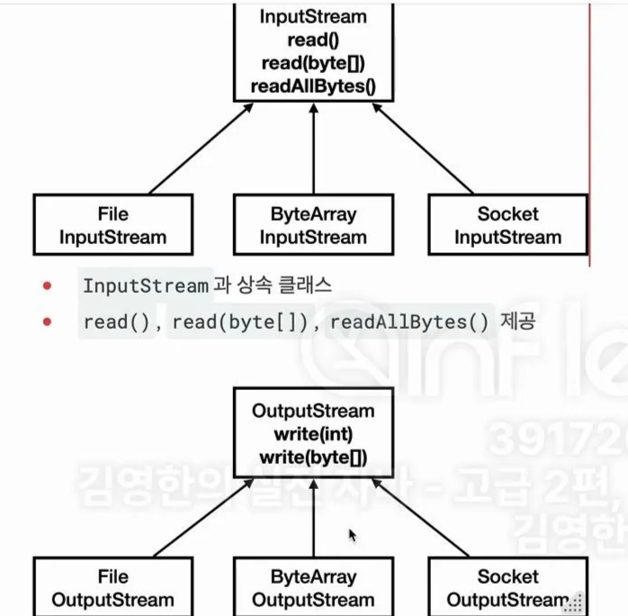

# I/O 기본 및 활용

## 요약

- 자바에서 입출력을 하려면 Stream을 만들어야하고 이때 byte로 데이터를 주고받는다.
- buffer를 쓰면 I/O가 효율적인데 이를 위한 class가 있다.
- 문자를 주고 받을때 byte로 변환해서 주고 받기 귀찮은데 이를 위한 Writer, Reader 클래스가 있다.
- 그 외 다양한 Stream 클래스가 있다.

## 스트림

자바가 가진 데이터를 `hello.dat` 라는 파일에 저장하려면

- 자바 프로세스가 가지고 있는 데이터를 밖으로 내보내려면 출력 스트림을 이용
- 외부 데이터를 자바 프로세스 안으로 가져오려면 입력 스트림을 이용

스트림을 쓰면 외부 자원이므로 꼭 닫아줘야한다. 자바 내부 객체는 자동으로 GC가 되지만 외부 자원은 그렇지 못하기 때문이다.

## InputStream, OutputStream

현대 컴퓨터는 대부분 byte 단위로 데이터를 주고 받는다.

이렇게 데이터를 주고 받는 것을 I/O라고 한다.

I/O의 대상은 파일, 네트워크, 콘솔 등이 있을 수 있는데 각각 데이터를 주고 받는 방식이 다르면 불편함

→ InputStream, OutputStream으로 추상화하였고, 구현체도 다 제공한다.



### 파일 입출력 성능 최적화

- `BufferedOutputStream & BufferedInputStream` 을 사용하자.
- buffer size 단위로 I/O를 알아서 처리해주는 기능을 제공해준다.

**BufferedOutputStream**

- 사용 예시 코드

```java
FileOutputStream fos = new FileOutputStream(FILE_NAME);

// BufferedOutputStream 은 단순히 내부에서 버퍼 기능만 제공한다.
// 따라서 반드시 대상 OutputStream 이 필요하다. (생성자로 전달)
BufferedOutputStream bos = new BufferedOutputStream(fos, BUFFER_SIZE);

for (int i = 0; i < FILE_SIZE; i++) {
	bos.write(1);
}
bos.close();
```

- `BufferedOutputStream` 은 내부에 `byte[] buf` 라는 버퍼를 가지고 있다.
- `write(byte)` 를 통해 byte를 하나 전달하면 내부 버퍼에 보관
- 그러다가 내부 버퍼가 가득차면 생성자로 전달해준 `FileOutputStream`에 있는 `write()` 메서드 호출
- 그 후 전달했으니 내부 버퍼는 비우고 다시 `write(byte)` 메서드가 호출되면 버퍼를 채우는 것을 반복한다.
- 마무리는 `close()`로 자원을 닫아주는데 이 때 `flush()`도 같이 호출된다.

**BufferedInputStream**

- 사용 예시 코드

```java
FileInputStream fis = new FileInputStream(FILE_NAME);
BufferedInputStream bis = new BufferedInputStream(fis, BUFFER_SIZE);

int data;
while ((data = bis.read()) != -1) {}
bis.close();
```

- BufferedInputStream 에서 read()를 하면 내부 버퍼를 조회한다.
    - 내부 버퍼에 아무것도 없으면 BUFFER_SIZE만큼 데이터 불러온다. (내부 버퍼에 담아놓기)
    - 내부 버퍼에 데이터가 있으면 정해진 사이즈만큼 내부 버퍼에서 데이터를 불러온다.

## 문자 다루기

### 스트림을 문자로

스트림의 모든 데이터는 byte 단위를 사용한다. 따라서 byte가 아닌 문자를 스트림에 직접 전달할 수 없다.

예를 들어 String 문자를 스트림을 통해 파일에 저장하려면 String을 byte로 변환한 다음 저장해야한다.

```java
String writeString = "ABC";

// 문자를 byte로 변환
byte[] writeBytes = writeString.getBytes(UTF_8);

FileOutputStream fos = new FileOutputStream(FILE_NAME);
fos.write(writeBytes);
fos.close();

// 파일 읽기
FileInputStream fis = new FileInputStream(FILE_NAME);
byte[] readBytes = fis.readAllBytes();
fis.close()

// byte -> STring UTF-8 디코딩
String readString = new String(readBytes, UTF_8)
```

근데 이렇게 변환하는게 번거로운데 변환해주는 구현체 없나..? → 있다!!

- **OutputStreamWriter : 스트림에 byte 대신 문자를 저장할 수 있게 지원한다.**
- **InputStreamReader : 스트림이 byte 대신 문자를 읽을 수 있게 지원한다.**

```java
String writeString = "ABC";

// 파일에 쓰기
FileOutputStream fos = new FileOutputStream(FILE_NAME);
OutputStreamWriter osw = new OutputStreamWriter(fos, UTF_8);
osw.write(); // byte 변환 안해도 알아서 써줌
osw.close();

// 파일에서 읽기
FileInputStream fis = new FileInputStream(FILE_NAME);
InputStreamReader isr = new InputStreamReader(fis, UTF_8);

StringBuilder sb = new StringBuilder();
int ch;
while((ch = isr.read()) != -1) {
	sb.append((char) ch);
}
isr.close();
```

자바에서는 스트림을 다루는 클래스와 문자를 다루는 클래스를 나누어 놨다.

- 스트림을 다루는 클래스 → `XxxOutputStream`, `XxxInputStream`
- 문자를 다루는 클래스 → `XxxWriter`, `XxxReader`

### **스트림 코드를 없애는 방식**

```java
String writeString = "ABC";

FileWriter fw = new FileWriter(FILE_NAME, UTF_8);
fw.write(writeString);
fw.close();

// 파일에서 읽기
StringBuilder content = new StringBuilder();
FileReader fr = new FileReader(FILE_NAME, UTF_8);
int ch;
while ((ch = fr.read) != -1) {
	content.append((char) ch);
}
```

### BufferedReader & BufferedWriter

- Reader, Writer 에도 버퍼 기능을 제공하는 클래스가 있다.
- 추가로 문자를 다룰 때는 한줄 단위로 다룰 때가 많아서 BufferedReader는 한줄 읽기 기능을 추가 제공한다.

```java
String writeString = "ABC\n가나다";

FileWriter fw = new FileWriter(FILE_NAME, UTF_8);
BufferedWriter bw = new BufferedWriter(fw, BUFFER_SIZE);
bw.write(writeString);
bw.close();

// 파일에서 읽기
StringBuilder content = new StringBuilder();
FileReader fr = new FileReader(FILE_NAME, UTF_8);
BufferedReader br = new BufferedReader(fr, BUFFER_SIZE);

String line;
while ((line = br.readerLine()) != null) {
	content.append(line).append("\n");
}
```

## 기타 스트림

- 위에서 살펴본 스트림 외에도 수많은 스트림이 존재하는데 몇가지 유용한 것만 알아보자

### PrintStream

- System.out에서 사용하는 스트림이다.
- PrintStream과 FileOutputStream을 조합하면 콘솔에 출력하듯이 파일에 출력할 수 있다.

```java
FileOutputStream fos = new FileOutputStream(FILE_PATH);
PrintStream ps = new PrintStream(fos);

ps.println("hello java!");
ps.println(10); // 숫자도 받아서 string으로 바꾼다.
ps.close();
```

### DataOutputStream

```java
FileOutputStream fos = new FileOutputStream(FILE_PATH);
DataOutputStream dos = new DataOutputStream(fos);

dos.wirteUTF("회원A");
dos.writeInt(20);
dos.writeDouble(10.5);
dos.wirtheBoolean(true);
dos.close()

// 파일 읽기
FileInputStream fis = new FileInputStream(FILE_PATH);
DataInputStream dis = new DataInputStream(fis);
dis.readUTF();
dis.readInt();
dis.readDouble();
dis.readBoolean();
```

## I/O 활용

### 객체 직렬화 (Serialization)

- 메모리에 있는 객체 인스턴스를 바이트 스트림으로 변환하여 파일에 저장하거나 네트워크를 통해 전송할 수 있도록 하는 기능
- 바이트 스트림을 객체 인스턴스로 변환하는 과정은 `역직렬화`라고 한다.
- `serialVersionUID` : 객체 직렬화 버전을 관리
- `trasnsient` 키워드 : 해당 키워드가 붙은 필드는 직렬화 하지않고 무시한다.

```java
public interface Serializable { } // 마커 인터페이스
```

### **객체 직렬화의 한계**

- 버전 관리의 어려움
    - 클래스 구조 변경시 이전 직렬화된 객체와의 호환성 문제 발생
    - serialVersionUID 관리가 복잡하다.
- 성능 이슈
    - 직렬화/역직렬화하는 과정이 상대적으로 느리고 리소스를 많이 사용한다.
- 크기 효율성
    - 직렬화된 데이터 크기가 상대적으로 크다.

등등

### **객체 직렬화의 대안**

- XML, JSON 등

### XML

```java
<member>
  <id>id1</id>
  <name>name1</name>
  <age>20</age>
</member>
```

- 유연하고 강력하나, 복잡성과 무거움 문제가 있다.
- tag를 포함한 XML 문서 크기가 커서 네트워크 비용이 크다.

### JSON

```java
{ "member": 
	{
    "id": "id1",
    "name": "name1", 
    "age": 20 
  } 
}
```

- 가볍고 간결하며 자바스크립트와 자연스러운 호환성이 있어 웹 개발자들이 좋아한다.
- 현재 표준 데이터 교환 포맷이다.

### Protobuf, Avro

- JSON은 거의 모든 곳과 호환이 가능하고, 사람이 읽고 쓰기 쉬운 텍스트 기반 포맷이라 디버깅과 개발이 쉽다.
- 다만 매우 작은 용량, 더 빠른 속도가 필요하다면 Protobuf, Avro 등을 고려해볼 수 있다.
- 호환성이 떨어지지만 byte 기반으로 용량과 성능이 최적화 되어있다.
- 다만 JSON에 비해 사람이 직접 읽기는 어렵다.

→ 대부분 JSON으로도 충분하다.