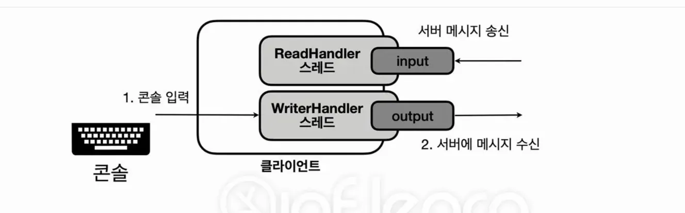

# 채팅 프로그램

## 설계

- 서버에 접속한 사용자는 모두 대화할 수 있어야한다.
- 채팅 명령어는 다음과 같다.
    - /join | {name} → 채팅서버 접속시 사용자 이름 입력
    - /message | {내용} → 모든 사용자에게 메시지 전달
    - /change | {name} → 사용자 이름 변경
    - /users → 전체 사용자 목록 출력
    - /exit → 채팅 서버 접속 종료

### 클라이언트 설계

사용자 콘솔 입력과 서버로부터 메시지를 받는 부분을 별도의 스레드로 분리해야한다.



### 서버 설계

한명이 이야기하면 전부 그 이야기를 들을 수 있어야한다.

하나의 클라이언트가 보낸 메시지를 서버가 받은 다음 모든 클라이언트에게 메시지를 다시 전송해야한다.

## 클라이언트

- 콘솔에 입력을 받아 서버로 전송
- 서버로부터 오는 메시지를 콘솔에 출력

```java
public class ReadHandler implements Runnable {

    private final DataInputStream input;
    private final Client client;
    public boolean closed = false;

    public ReadHandler(DataInputStream input, Client client) {
        this.input = input;
        this.client = client;
    }

    @Override
    public void run() {
        while (true) {
            try {
                String message = input.readUTF();
                System.out.println(message);
            } catch (IOException e) {
                throw new RuntimeException(e);
            } finally {
                client.close();
            }
        }
    }

    public synchronized void close() {
        if (closed) return;
        closed = true;
    }
}
```

```java
public class WriteHandler implements Runnable {

    private static final String DELIMITER = "|";

    private final DataOutputStream output;
    private final Client client;
    private boolean closed = false;

    public WriteHandler(DataOutputStream output, Client client) {
        this.output = output;
        this.client = client;
    }

    @Override
    public void run() {
        Scanner scanner = new Scanner(System.in);

        try {
            String username = getUsername(scanner);
            output.writeUTF("/join" + DELIMITER + username);

            while (true) {
                String message = scanner.nextLine(); // 블로킹
                if (message.isEmpty()) continue;

                if (message.equals("/exit")) {
                    output.writeUTF(message);
                    break;
                }

                // "/" 로 시작하면 명령어, 나머지는 일반 메시지
                if (message.startsWith("/")) {
                    output.writeUTF(message);
                } else {
                    output.writeUTF("/message" + DELIMITER + message);
                }

            }

        } catch (IOException | NoSuchElementException e) {
            throw new RuntimeException(e);
        } finally {
            client.close();
        }

    }

    private static String getUsername(Scanner scanner) {
        System.out.println("이름을 입력하세요.");
        String username;
        do {
            username = scanner.nextLine();
        } while (username.isBlank());
        return username;
    }

    public synchronized void close() {
        if (closed) return;

        try {
            System.in.close(); // Scanner 입력 중지 (사용자의 입력을 닫음)
        } catch (Exception e) {
            throw new RuntimeException(e);
        }
        closed = true;
    }
}
```

```java
public class Client {

    private final String host;
    private final int port;

    private Socket socket;
    private DataInputStream input;
    private DataOutputStream output;

    private ReadHandler readHandler;
    private WriteHandler writeHandler;
    private boolean closed = false;

    public Client(String host, int port) {
        this.host = host;
        this.port = port;
    }

    public void start() throws IOException {
        socket = new Socket(host, port);
        input = new DataInputStream(socket.getInputStream());
        output = new DataOutputStream(socket.getOutputStream());

        readHandler = new ReadHandler(input, this);
        writeHandler = new WriteHandler(output, this);

        Thread readThread = new Thread(readHandler);
        Thread writeThread = new Thread(writeHandler);
        readThread.start();
        writeThread.start();
    }

    public synchronized void close() {
        if (closed) return;
        readHandler.close();
        writeHandler.close();
        closeAll(socket, input, output);
        closed = true;
    }
}
```

```java
public class ClientMain {

    public static final int PORT = 12345;

    public static void main(String[] args) throws IOException {
        Client client = new Client("localhost", PORT);
        client.start();
    }
    
}
```

## 서버


[서버 구현 코드 링크](https://github.com/JwahoonKim/spring-sandbox/tree/main/java-adv2/src/chat/server)

### Command Pattern

요청이나 명령을 독립적인 객체로 변환하는 것

구현 코드 링크에서 Command 인터페이스와 구현체를 보면 알 수 있다.

**[장점]**

새로운 커맨드를 쉽게 추가할 수 있다. → Command 구현체만 추가하면 됨 → OCP 원칙 지키기 가능

클라이언트에 if 문이 덕지덕지 생기는 것을 막을 수 있다. → 기능이 명확하게 분리되어 어떤 기능을 수정해야할 때 수정해야하는 클래스가 아주 명확해진다.

**[단점]**

복잡성이 증가한다. → 여러 클래스들을 오가야하기 때문에 코드가 어려워진다.

- if문 몇개로 해결되고 딱히 확장할 필요가 없다면 굳이 쓸 필요가 없다.
