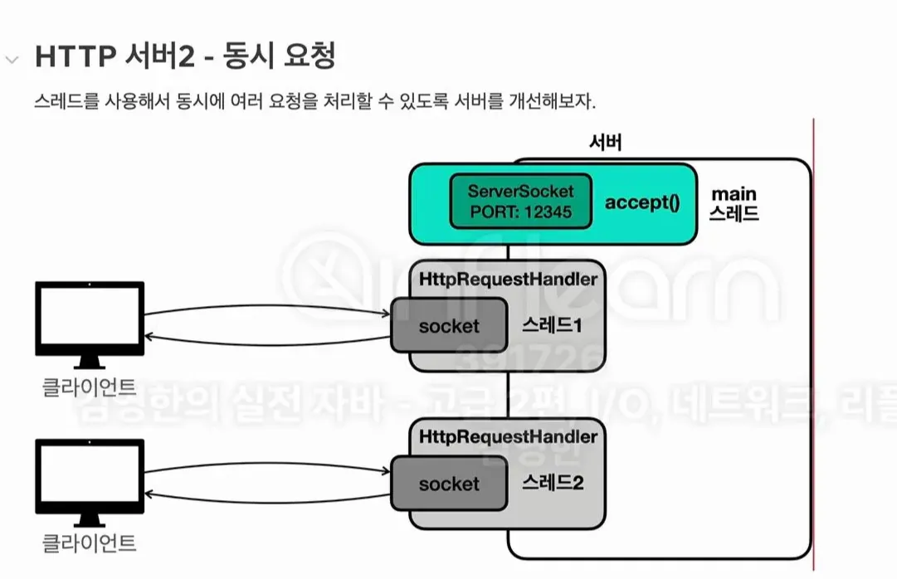

# HTTP 서버 만들기

웹브라우저에서 우리 서버에 접속하면 다음과 같은 HTML을 응답하게 하도록 만들어보자

```java
<h1>Hello World</h1>
```

### HTTP Server V1

- [v1 코드 링크](https://github.com/JwahoonKim/spring-sandbox/tree/main/java-adv2/src/was/v1)
- ServerSocket을 이용하여 HTML 을 내려주는 코드를 작성
- 잘 내려가는데 문제는 이렇게 코드를 작성하면 스레드 하나만을 이용하여 요청을 순차적으로 밖에 처리를 못한다. → 클라이언트 요청에 대한 응답이 느려짐

### HTTP Sever V2

- [v2 코드 링크](https://github.com/JwahoonKim/spring-sandbox/tree/main/java-adv2/src/was/v2)



- ExecutorService를 이용하여 멀티스레드로 요청을 받도록 변경하자.

### HTTP Sever V3

- [v3 코드 링크](https://github.com/JwahoonKim/spring-sandbox/tree/main/java-adv2/src/was/v3)
- 이제 HTTP 서버 작동 원리를 이해했으니 경로별로 다른 응답을 주는 기능을 만들어보자.

### URL 인코딩

- HTTP 메시지에서 시작 라인과 HTTP 헤더의 이름은 항상 ASCII를 사용해야 한다.
- HTTP 메시지 바디는 UTF-8 과 같은 다른 인코딩을 사용할 수 있다.

**[왜 그럴까?]**

- 인터넷이 처음 설계되던 시기에는 대부분 컴퓨터 시스템이 ASCII 문자 집합을 사용했다.
- HTTP URL이 ASCII 만을 지원하는 이유는 초기 인터넷의 기술적 제약과 전세계적인 호환성을 유지하기 위한 선택이었다.
- 지금도 하위호환성을 위해서 ASCII를 사용한다.

그렇다면 `/search?q=가나다` 와 같은 URL에 한글(UTF-8)을 전달하려면 어떻게해야할까?

- UTF-8 로 표현한 뒤 각 바이트에 %를 붙인다.
- 가 = EABO80 (UTF-8) → %EA%BO%80 으로 표현함.
- 이런 방식을 사용하면 ASCII를 사용하여 UTF-8을 표현할 수 있다.
- 이런 방식을 퍼센트 인코딩이라고 한다.
- 자바에서는 URLEncoder.encode(), URLDecoder.decode() 를 사용하면 퍼센트 인코딩, 디코딩을 처리할 수 있다.

### HTTP Sever V4

HTTP 요청 메시지와 응답 메시지는 규칙이 있으므로, 각 규칙에 맞추어 객체로 만들면 단순히 String으로 다루는 것보다 훨씬 구조적이고 객체지향적으로 만들 수 있다.

- [v4 코드 링크](https://github.com/JwahoonKim/spring-sandbox/tree/main/java-adv2/src/was/v4)
- HttpRequest, HttpResponse 객체를 통해서 더 편하게 요청, 응답을 다룰 수 있게 되었다.

### HTTP Server V5

- [v5 코드 링크](https://github.com/JwahoonKim/spring-sandbox/tree/main/java-adv2/src/was/v5)

HTTP 서버와 관련된 부분을 구조화해보자.

서비스 개발을 위한 로직과 HTTP를 다루는 로직을 명확히 분리해보자.

```java
if (request.getPath().equals("/site1")) {
    site1(response);
} else if (request.getPath().equals("/site2")) {
    site2(response);
} else if (request.getPath().equals("/search")) {
    search(request, response);
} else if (request.getPath().equals("/ ")) {
    home(response);
} else {
    notFound(response);
}
```

이 부분은 서비스 관련된 부분이니까 떼어내기.

- HTTP 서버 관련 코드는 전부 was.httpserver 패키지로 이동
- 서비스 개발 로직은 전부 v5.servlet 패키지로 이동

### 웹 애플리케이션 서버의 역사

우리가 만든 was.httpserver 패키지를 이용하면 HTTP 파싱, 네트워크, 멀티스레드 관련 기능들을 모두 해결할 수 있다. 이제 비즈니스 로직들은 httpServlet 구현체만 만들면 쉽게 구현이 가능하다.

WAS는 Web Application Server의 약자인데, 이 때 Application 이라는 단어가 들어가는 이유는 프로그램 코드도 수행할 수 있는 서버라는 뜻이다.

즉, HTTP 기반으로 작동하는 서버인데 프로그램 코드도 실행할 수 있는 서버인 것이다.

여기서 말하는 프로그램 코드는 앞서 v5에서 작성했던 서블릿 구현체들이다.

1990년대에 자바 진영에서 서블릿이라는 표준이 등장하게 된다.

- Servlet, HttpServlet, ServletRequest, ServletResponse 등을 포함한 많은 표준을 제공한다.
- HTTP 서버를 만드는 회사들은 모두 서블릿을 기반으로 기능을 제공한다.

서블릿을 제공하는 주요 WAS는 다음과 같다.

- Tomcat
- Jetty
- Undertow
- 등등

HTTP 서버를 만드는 회사들이 서블릿을 기반으로 기능을 제공하는 덕분에 개발자는 Servlet 인터페이스만 구현하면 된다. 성능 및 부가 기능이 필요해서 다른 WAS로 변경하는 상황이 와도 기존에 구현한 Servlet을 그대로 사용할 수 있다.
